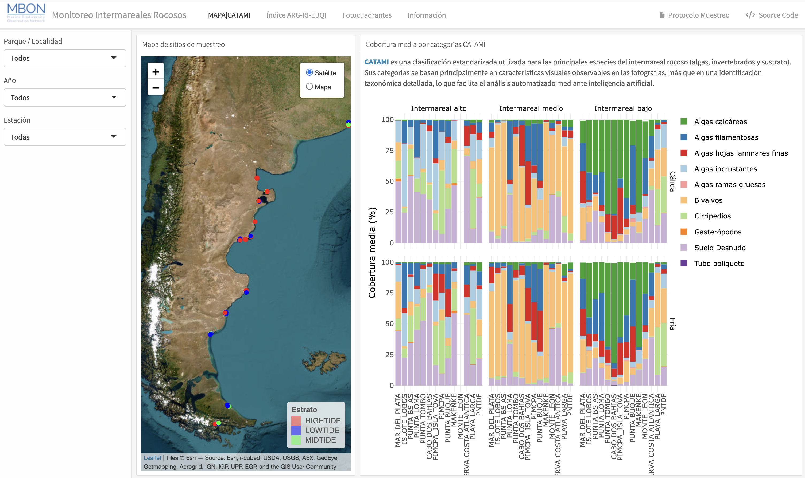

# Rocky Intertidal Monitoring Dashboard

This repository contains an **interactive dashboard** designed to visualize and explore data from rocky intertidal monitoring surveys. The dashboard integrates photoquadrat data processed with artificial intelligence to provide an accessible overview of biodiversity patterns and ecological conditions across monitored sites.

The tool allows users to explore spatial, temporal, and ecological information derived from standardized monitoring protocols implemented within the **MBON Pole to Pole network**.

🔗 **Live dashboard:**  
https://mbon-poletopole.shinyapps.io/monitoreo-intermareal/

## Dashboard Preview

---

## Overview

The dashboard compiles thousands of intertidal photoquadrats and summarizes them through interactive visualizations. Data are classified using **CATAMI categories**, which group organisms based primarily on visual characteristics observable in images (growth forms and morphology), enabling consistent analysis through automated image annotation tools.

The platform also includes the **ARG-RI-EBQI (Argentine Rocky Intertidal Ecosystem-Based Quality Index)**, an ecological index designed to evaluate the condition of the **mid-intertidal zone** using key habitat-forming organisms such as mussels and macroalgae, together with the proportion of bare substrate.

---

## Features

- **Interactive map**
  - Explore sampling locations and monitoring sites.
  - View spatial distribution of photoquadrats and ecological index values.

- **Benthic cover visualization**
  - Stacked bar charts summarizing percent cover of CATAMI categories.
  - Data organized by locality, site, tidal level, and season.

- **ARG-RI-EBQI ecological index**
  - Map visualization of the average ecological condition for each locality or site.
  - Bar charts showing the distribution of photoquadrats across ecological classes.

- **Sampling effort metrics**
  - Number of photoquadrats collected.
  - Equivalent surveyed area.
  - Number of sampling days.
  - Spatial coverage of monitoring sites.

- **Direct access to images**
  - Links to CoralNet image repositories for each monitored locality.

---

## Ecological Index (ARG-RI-EBQI)

The **ARG-RI-EBQI (Argentine Rocky Intertidal Ecosystem-Based Quality Index)** ranges from **0 to 10** and summarizes the ecological condition of the mid-intertidal zone.

Higher values indicate healthier conditions characterized by well-developed mussel beds and structured macroalgal assemblages.

Index categories:

| Category | Range |
|--------|--------|
| High | ≥ 7.5 |
| Good | 6.0 – 7.49 |
| Moderate | 4.5 – 5.99 |
| Poor | 3.5 – 4.49 |
| Bad | < 3.5 |

---

## Data Source

Data originate from **standardized rocky intertidal monitoring protocols** implemented across protected areas and coastal sites. The methodology is part of the **Marine Biodiversity Observation Network (MBON) Pole to Pole program**.

Relevant documentation:

- Intertidal monitoring protocol  
  https://repository.oceanbestpractices.org/handle/11329/2199.2

- Workshop publications describing the monitoring framework  
  https://riojournal.com/article/126660/  
  https://riojournal.com/article/163815/

---

## Project Status

⚠️ The dashboard is **currently under active development**.

The present version includes monitoring sites from **Argentina**, and additional regions from other participating countries will be incorporated as data processing and harmonization progresses.

---

## Author

**Dr. Gonzalo Bravo**  
Implementation of Artificial Intelligence Tools for Marine Biodiversity Monitoring in Protected Areas  

Marine Biodiversity Observation Network (MBON) – Pole to Pole
